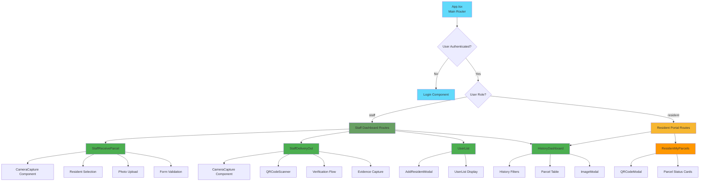

# Component Architecture

## Component Hierarchy Diagram



## Component Overview

### Core Components

#### App.tsx
- **Purpose**: Main application router and state management
- **State**: `user` (User | null), `loading` (boolean)
- **Responsibilities**:
  - Route protection based on authentication
  - Role-based navigation (staff/resident)
  - User session management (localStorage)
  - Login/logout handlers

#### Login Component
- **Purpose**: User authentication
- **Features**:
  - Role selection (staff/resident)
  - Form validation
  - Error handling
  - Thai language interface

### Staff Components

#### StaffReceiveParcel
- **Purpose**: Receive and log incoming parcels
- **Features**:
  - Resident selection (dropdown + search)
  - Tracking number input
  - Carrier selection
  - Camera/photo capture
  - Form validation
  - Success notifications

#### StaffDeliveryOut
- **Purpose**: Hand over parcels to residents
- **Features**:
  - QR code scanner (html5-qrcode)
  - Parcel verification
  - Evidence photo capture
  - Collection confirmation
  - Real-time updates

#### UserList
- **Purpose**: Manage resident accounts
- **Features**:
  - Display all residents
  - Add new resident modal
  - Search/filter functionality
  - Room number validation

#### HistoryDashboard
- **Purpose**: View parcel history
- **Features**:
  - Filter by room number
  - Date range filter
  - Status indicators
  - Export functionality
  - Pagination

### Resident Components

#### ResidentMyParcels
- **Purpose**: Resident's personal parcel view
- **Features**:
  - List all assigned parcels
  - Status indicators (pending/collected)
  - Generate QR codes
  - Photo thumbnails
  - Parcel details

### Shared Components

#### CameraCapture
- **Purpose**: Reusable camera/photo capture
- **Features**:
  - Video stream access
  - Photo capture
  - File upload fallback
  - Preview functionality
  - Base64 conversion

#### QRCodeModal
- **Purpose**: Display QR code for parcel collection
- **Features**:
  - QR code generation
  - Download option
  - Print-friendly
  - Modal dialog

#### AddResidentModal
- **Purpose**: Register new residents
- **Features**:
  - Form validation
  - Username uniqueness check
  - Room number availability check
  - Password hashing

#### ImageModal
- **Purpose**: Display parcel photos
- **Features**:
  - Full-size image view
  - Zoom capability
  - Close on backdrop click
  - Evidence photo comparison

#### HistoryDashboard
- **Purpose**: Shared history view (staff/resident)
- **Staff features**: All parcels with filters
- **Resident features**: Personal parcel history only

## Routing Structure

```typescript
// Public Routes
/login → Login Component

// Staff Routes (authenticated + role='staff')
/receive-parcel → StaffReceiveParcel
/delivery-out → StaffDeliveryOut
/history → HistoryDashboard (full access)
/users → UserList

// Resident Routes (authenticated + role='resident')
/my-parcels → ResidentMyParcels
/history → HistoryDashboard (filtered)

// Default Redirect
/ → /receive-parcel (staff) or /my-parcels (resident)
```

## Props Interface Patterns

```typescript
// Standard component props
interface ComponentProps {
  user: User;           // Current user object
  onLogout: () => void; // Logout handler
}

// Example usage
const StaffReceiveParcel: React.FC<ComponentProps> = ({ user, onLogout }) => {
  // Component logic
};
```

## State Management Patterns

### Local State
```typescript
const [loading, setLoading] = useState(false);
const [message, setMessage] = useState<{ type: 'success' | 'error'; text: string } | null>(null);
```

### API State
```typescript
const [residents, setResidents] = useState<User[]>([]);
const [parcels, setParcels] = useState<Parcel[]>([]);
```

### Form State
```typescript
const [formData, setFormData] = useState({
  tracking_number: '',
  carrier_name: '',
  resident_id: 0
});
```

## Data Flow Between Components

```
Login → App (sets user state) → Role-based routing → Component receives user prop → Component makes API calls → Updates UI
```

## Reusable Hooks Pattern

```typescript
// Example: Custom hook for data fetching
const useResidents = () => {
  const [residents, setResidents] = useState<User[]>([]);
  const [loading, setLoading] = useState(true);
  
  useEffect(() => {
    const loadResidents = async () => {
      try {
        const response = await usersAPI.getResidents();
        if (response.success) {
          setResidents(response.residents);
        }
      } catch (error) {
        console.error('Error loading residents:', error);
      } finally {
        setLoading(false);
      }
    };
    loadResidents();
  }, []);
  
  return { residents, loading };
};
```
