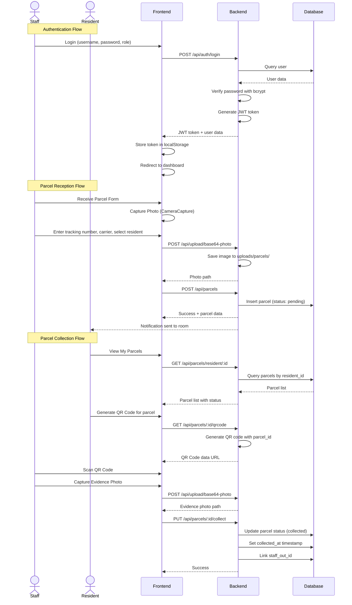
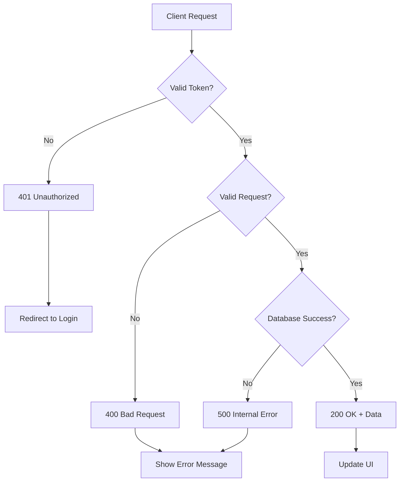

# Data Flow Diagrams

## User Authentication & Parcel Management Flow

## Key Data Flows

### 1. Authentication Flow
- User submits credentials → Backend validates → JWT token issued → Token stored → All subsequent requests include token

### 2. Parcel Reception Flow (Staff Only)
- Select/enter resident → Capture parcel photo → Enter details → Create parcel record → Notification sent

### 3. Parcel Collection Flow (Staff + Resident)
- Resident views parcels → Generates QR code → Staff scans QR → Captures evidence photo → Marks as collected

### 4. Photo Upload Flow
- Camera capture → Base64 encoding → Upload endpoint → Server saves to disk → Returns file path

### 5. History Query Flow
- Apply filters (room, date range) → Query with params → Join users and parcels → Return paginated results

## State Management

### Client-Side State (React)
- **User State**: Stored in localStorage and React state
- **Auth Token**: Stored in localStorage, added to request headers
- **Component State**: Local useState for forms, loading states
- **Navigation**: React Router for page transitions

### Server-Side State (SQLite)
- **Users Table**: Authentication and profile data
- **Parcels Table**: Transaction records with status tracking
- **File Storage**: Photos saved to filesystem with reference paths

## Error Handling Flow

