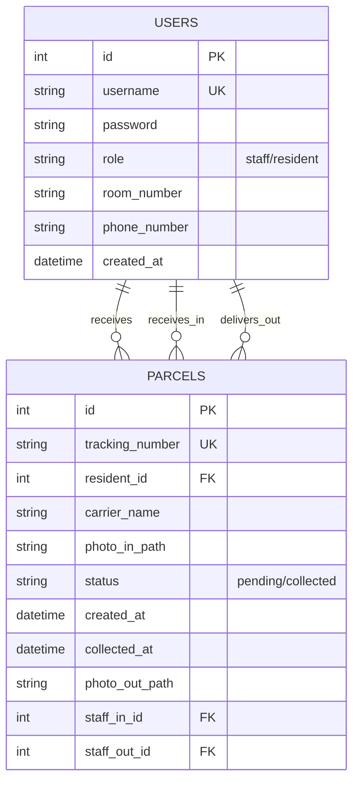

# Database Schema

## Entity-Relationship Diagram



## Table Definitions

### users Table

| Column | Type | Constraints | Description |
|--------|------|-------------|-------------|
| id | INTEGER | PRIMARY KEY AUTOINCREMENT | Unique user identifier |
| username | TEXT | UNIQUE NOT NULL | Login username |
| password | TEXT | NOT NULL | Hashed password (bcrypt) |
| role | TEXT | NOT NULL CHECK (role IN ('staff', 'resident')) | User role |
| room_number | TEXT | - | Room number (residents only) |
| phone_number | TEXT | NOT NULL | Contact phone number |
| created_at | TEXT | NOT NULL DEFAULT CURRENT_TIMESTAMP | Account creation timestamp |

### parcels Table

| Column | Type | Constraints | Description |
|--------|------|-------------|-------------|
| id | INTEGER | PRIMARY KEY AUTOINCREMENT | Unique parcel identifier |
| tracking_number | TEXT | UNIQUE NOT NULL | Carrier tracking number |
| resident_id | INTEGER | NOT NULL FK | Reference to users.id |
| carrier_name | TEXT | NOT NULL | Delivery company name |
| photo_in_path | TEXT | - | Path to incoming parcel photo |
| status | TEXT | NOT NULL DEFAULT 'pending' CHECK (status IN ('pending', 'collected')) | Parcel status |
| created_at | TEXT | NOT NULL DEFAULT CURRENT_TIMESTAMP | Reception timestamp |
| collected_at | TEXT | - | Collection timestamp |
| photo_out_path | TEXT | - | Path to collection evidence photo |
| staff_in_id | INTEGER | FK | Staff who received parcel (users.id) |
| staff_out_id | INTEGER | FK | Staff who handed over parcel (users.id) |

## Foreign Key Relationships

```
parcels.resident_id → users.id
parcels.staff_in_id → users.id
parcels.staff_out_id → users.id
```

## Indexes

```sql
CREATE INDEX idx_users_role ON users(role);
CREATE INDEX idx_users_room_number ON users(room_number);
CREATE INDEX idx_parcels_resident_id ON parcels(resident_id);
CREATE INDEX idx_parcels_status ON parcels(status);
CREATE INDEX idx_parcels_tracking_number ON parcels(tracking_number);
```

## Sample Data Structure

### Staff User
```json
{
  "id": 1,
  "username": "staff01",
  "role": "staff",
  "phone_number": "081-234-5678",
  "created_at": "2025-01-01 10:00:00"
}
```

### Resident User
```json
{
  "id": 2,
  "username": "resident101",
  "role": "resident",
  "room_number": "011",
  "phone_number": "081-987-6543",
  "created_at": "2025-01-01 10:00:00"
}
```

### Parcel Record
```json
{
  "id": 1,
  "tracking_number": "TH123456789",
  "resident_id": 2,
  "carrier_name": "Kerry Express",
  "photo_in_path": "/uploads/parcels/1/photo_in-123456789.jpg",
  "status": "pending",
  "created_at": "2025-01-15 14:30:00",
  "collected_at": null,
  "photo_out_path": null,
  "staff_in_id": 1,
  "staff_out_id": null
}
```

## Data Lifecycle

### Parcel Status Transitions

```
pending (created) → collected (handed over)
```

1. **When parcel is received**:
   - `status = 'pending'`
   - `created_at = CURRENT_TIMESTAMP`
   - `staff_in_id = current_staff.id`
   - `photo_in_path = uploaded_photo_path`

2. **When parcel is collected**:
   - `status = 'collected'`
   - `collected_at = CURRENT_TIMESTAMP`
   - `staff_out_id = current_staff.id`
   - `photo_out_path = evidence_photo_path`

## Database Schema (SQL)

```sql
-- Users table
CREATE TABLE IF NOT EXISTS users (
  id INTEGER PRIMARY KEY AUTOINCREMENT,
  username TEXT UNIQUE NOT NULL,
  password TEXT NOT NULL,
  role TEXT NOT NULL CHECK (role IN ('staff', 'resident')),
  room_number TEXT,
  phone_number TEXT NOT NULL,
  created_at TEXT NOT NULL DEFAULT CURRENT_TIMESTAMP
);

-- Parcels table
CREATE TABLE IF NOT EXISTS parcels (
  id INTEGER PRIMARY KEY AUTOINCREMENT,
  tracking_number TEXT UNIQUE NOT NULL,
  resident_id INTEGER NOT NULL,
  carrier_name TEXT NOT NULL,
  photo_in_path TEXT,
  status TEXT NOT NULL DEFAULT 'pending' CHECK (status IN ('pending', 'collected')),
  created_at TEXT NOT NULL DEFAULT CURRENT_TIMESTAMP,
  collected_at TEXT,
  photo_out_path TEXT,
  staff_in_id INTEGER,
  staff_out_id INTEGER,
  FOREIGN KEY (resident_id) REFERENCES users(id),
  FOREIGN KEY (staff_in_id) REFERENCES users(id),
  FOREIGN KEY (staff_out_id) REFERENCES users(id)
);
```
