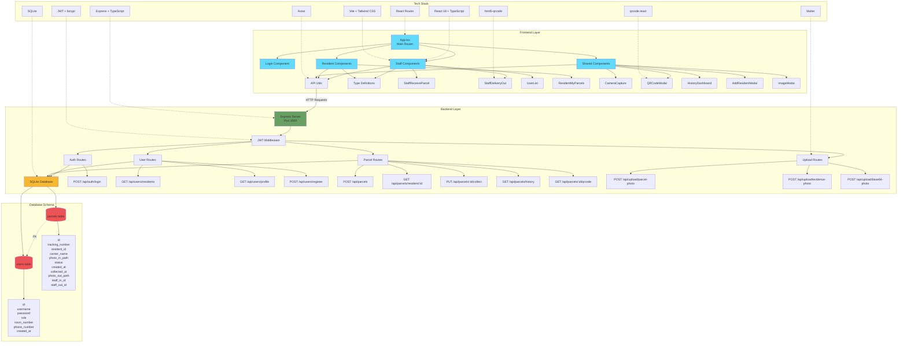

# iCondo System Architecture

## System Architecture Diagram

## Architecture Overview

The iCondo system follows a classic three-tier architecture:

### Frontend Layer (Port 5173)
- **Framework**: React 18 with TypeScript
- **Build Tool**: Vite
- **Styling**: Tailwind CSS
- **Routing**: React Router
- **HTTP Client**: Axios
- **Key Libraries**: qrcode.react, html5-qrcode

### Backend Layer (Port 3000)
- **Framework**: Express with TypeScript
- **Authentication**: JWT (JSON Web Tokens)
- **Database**: SQLite
- **File Upload**: Multer
- **Password Hashing**: bcrypt

### Database Layer
- **SQLite** for data persistence
- **Two main tables**: users and parcels
- **Indexes** for query optimization
